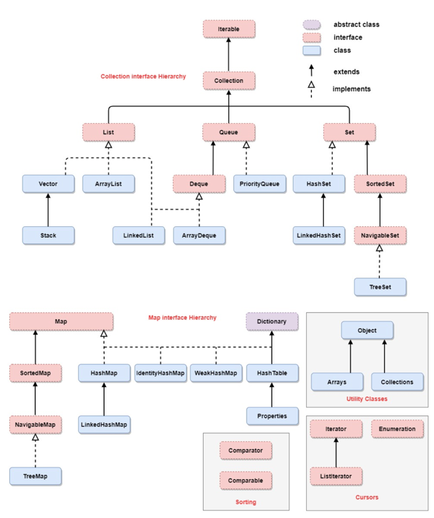

## Java Exam

| [Билет 01](./src/main/java/ru/minusd/ticket01/MergeArrays.java)     | [Билет 02](./src/main/java/ru/minusd/ticket02/ReversMap.java)        | [Билет 03](./src/main/java/ru/minusd/ticket03/ForIsUnique.java)           | [Билет 04](./src/main/java/ru/minusd/ticket04/HasOddSet.java)      | [Билет 05](./src/main/java/ru/minusd/ticket05/ForRarest.java)   |
|---------------------------------------------------------------------|----------------------------------------------------------------------|---------------------------------------------------------------------------|--------------------------------------------------------------------|-----------------------------------------------------------------|
| [Билет 06](./src/main/java/ru/minusd/ticket06/ToGuavaSort.java)     | [Билет 07](./src/main/java/ru/minusd/ticket07/LinkedIntList.java)    | [Билет 08](./src/main/java/ru/minusd/ticket08/Mystery.java)               | [Билет 09](./src/main/java/ru/minusd/ticket09/LinkedIntList.java)  | [-](./src/main/java/ru/minusd)                                  |
| [Билет 11](./src/main/java/ru/minusd/ticket11/LinkedIntList.java)   | [Билет 12*](./src/main/java/ru/minusd/ticket12)                      | [Билет 13*](./src/main/java/ru/minusd/ticket13)                           | [Билет 14](./src/main/java/ru/minusd/ticket14/ToEquals.java)       | [Билет 15](./src/main/java/ru/minusd/ticket15/SplitStack.java)  |
| [Билет 16](./src/main/java/ru/minusd/ticket16/StackCopier.java)     | [Билет 17*](./src/main/java/ru/minusd/ticket17)                      | [Билет 18](./src/main/java/ru/minusd/ticket18/LongestSortedSequence.java) | [Билет 19](./src/main/java/ru/minusd/ticket19/ForReverseHalf.java) | [Билет 20*](./src/main/java/ru/minusd/ticket20)                 |
| [Билет 21](./src/main/java/ru/minusd/ticket21)                      | [Билет 22](./src/main/java/ru/minusd/ticket22)                       | [Билет 23](./src/main/java/ru/minusd/ticket23)                            | [Билет 24](./src/main/java/ru/minusd/ticket24)                     | [Билет 25](./src/main/java/ru/minusd/ticket25/StackOnList.java) |
| [Билет 26](./src/main/java/ru/minusd/ticket26/ArrayListOnList.java) | [Билет 27](./src/main/java/ru/minusd/ticket27/ArrayListOnArray.java) | [Билет 28](./src/main/java/ru/minusd/ticket28)                            | [Билет 29](./src/main/java/ru/minusd/ticket29/StackOnArray.java)   | [Билет 30](./src/main/java/ru/minusd/ticket30/PowTwo.java)      |

* **[Билет 01](./src/main/java/ru/minusd/ticket01/theory.txt)**
    * Парадигма ООП. Основные принципы ООП и их реализация в Java & C++
    * Пронятие структуры данных список. Линейный список. Виды списков и их реализация на Java. Доступ к элементу
      структуры данных список. Использование список. Трудоемкость операции со списками.
    * [Задача](./src/main/java/ru/minusd/ticket01/MergeArrays.java) Напишите метод по названием alternate, который
      принимает 2 списка целых чисел и возращает новый список, содержащий чередующиеся элементы из двух
      списков. `[a0, b0, a1, b1, a2, b2, a3, b3, a4, a5]`
* **[Билет 02](./src/main/java/ru/minusd/ticket02/theory.txt)**
    * Получение информации о типе. Создание экземпляров классов. Вызов методов класса.
    * Оранизация программы на Java. Основные структурыне единицы. Процесс интерпретации и компиляции. Роль JVM.
    * [Задача](./src/main/java/ru/minusd/ticket02/ReversMap.java) Напищите метод reverse, который принимает Map от целых
      чисел к строкам в качестве параметра и возращает Map из строк к целым числам, который является "Зеркальным
      отображением"
* **[Билет 04](./src/main/java/ru/minusd/ticket04/theory.txt)**
    * Понятие класса. Определение, инициализация. Модификаторый доступа. Константы и переменные. Объявление классов.
    * Понятие поиска в массивах. Последовательный поиск. Сортировка методом прямого выбора. Использование ООП для
      програмирования алгоритмов поиска в массивах и коллекциях.
    * [Задача](./src/main/java/ru/minusd/ticket04/HasOddSet.java) Напишите метод hasOdd, который принимает множество (
      Set) целых чисел и возращает true6 если набор содержит хотя бы одно нечётное число.
* **[Билет 05](./src/main/java/ru/minusd/ticket05)**
    * [Задача](./src/main/java/ru/minusd/ticket05/ForRarest.java)
* **[Билет 06](./src/main/java/ru/minusd/ticket06/theory.txt)**
    * Оператор new. Понятие ссылки и указателя на объект. Реализация в C++ и Java. Время жизни объекта.
    * Оранизация работы с файлами в Java.
    * [Задача](./src/main/java/ru/minusd/ticket06/ToGuavaSort.java) /
      [Сложно](./src/main/java/ru/minusd/ticket06/ToGuavaSort2.java) Напишите методов с именем guavaSort, который
      принимает массив строк в качестве параметра и упорядочивает строки в массиве в отсортированном порядке
      возрастания. Должен использовать FJC (JFC) для Multiset или MultiMap для реализации алгоритма блочной сортировки,
      который будет работать со строками.
* **[Билет 07](./src/main/java/ru/minusd/ticket07/theory.txt)**
    * Переопределение методов в Java, абстрактные методы.
    * Иерархия классов ввода вывода. Работа с файлами в Java. Работа с файлами. Сериализация объектов.
    * [Задача](./src/main/java/ru/minusd/ticket07/LinkedIntList.java) Напишите метод removeAll, который можно добавить в
      класс linkedIntList. Метод должен эффективно удалить из отсортированного списка целых чисел все значения,
      появляющиеся во втором отсортированном списке.
* **[Билет 09](./src/main/java/ru/minusd/ticket09/theory.txt)**
    * Статические поля и методы. Класс Math, его основные методы.
    * Обобщённое програмирование. Понятие и использование джеенериков в Java
    * [Задача](./src/main/java/ru/minusd/ticket09/LinkedIntList.java) Напишите метод removeDuplicates, который можно
      доюавить в класс LinkedIntList. Метод должен удалить дубликаты из связного списка целых чисел.
* **[Билет 11](./src/main/java/ru/minusd/ticket11)**
    * Конструкторы, назначение и использоваине. Вызов конструктора родительского класса, неявный вызов конструктор
      родительского класса, порядок инициализации экземпляра Java класса.
    * Использование языка UML для проектирования и документации объектно-ориентированных программ. Основные UML
      диаграммы для оборажения отношений между классами в ООП программах.
    * [Задача](./src/main/java/ru/minusd/ticket11/LinkedIntList.java) Напишите метод firstLast, который можно добавить в
      класс LinkedIntList, который перемещает первый элемент спика в конец.
* **[Билет 14](./src/main/java/ru/minusd/ticket14/theory.txt)**
    * Примитивные и ссылочные типы данных. Использование механизмов автоупаковки и автораспаковки. Операция приведения
      типов. Понижающее и привышающее приведение.
    * Возможности Java Framework Collections. Интерфейс LinkedList и его основные методы.
    * [Задача](./src/main/java/ru/minusd/ticket14/ToEquals.java) Напишите метод equals, который принимает в качестве
      параметров 2 стека, и возвращает true, если стеки содержат одинаковые элементы в одинаковом порядке.
* **[Билет 15](./src/main/java/ru/minusd/ticket15/theory.txt)**
    * ООП в Java. Понятие объекта. Что представляет собой Java приложение с точки зрения ООП. Основные характеристики
      объектов в Java.
    * Возможности Java Framework Collections. Контейнер HashMap и его основные методы.
    * [Задача](./src/main/java/ru/minusd/ticket15/SplitStack.java) Напишите метод splitStack, который принимает стек
      целых чисел в качестве параметра и возращает стек, где все отрицательные числа в нижней части стека.
* **[Билет 16](./src/main/java/ru/minusd/ticket16/theory.txt)**
    * Работа со строками в Java, строковый хэш. Операция контакенации строк.
    * Возможности Java Framework Collections. Контейнер HashSet и его основные методы.
    * [Задача](./src/main/java/ru/minusd/ticket16/StackCopier.java) Напишите метод copyStack, который принимает стек
      целых чисел в качестве параметра и возращает его копию, можно использовать одну очередь.
* **[Билет 18](./src/main/java/ru/minusd/ticket18)**
    * Циклические конструкции в Java. Использование циклов для работы с массивами. Использование итераторов для работы с
      массивами.
    * Возможности Java Framework Collections. Интерфейс Map и его основные методы.
    * [Задача](./src/main/java/ru/minusd/ticket18/LongestSortedSequence.java) Напишите метод longestSortedSequence,
      который принимает в качестве параметра массив целых чисел и возвращает длину самой длинной последовательности
      отсортированных чисел в массиве.
* **[Билет 21](./src/main/java/ru/minusd/ticket21)**
    * Обработка строк в Java. Класс StringBuilder. Класс StringBuffer.
    * Паттерные проектирования программ. Паттерн Фабрика.
    * [Задача](./src/main/java/ru/minusd/ticket21) Напишите универсальны класс для реализации алгоритмов поиска. В
      каечтве параметров используйте массив интерфейсных ссылок.
* **[Билет 22](./src/main/java/ru/minusd/ticket22)**
    * Наследование, виды наследования и его реализация в Java и C++.
    * Паттерные проектирования программ. Паттерн Фабричный метод.
    * [Задача](./src/main/java/ru/minusd/ticket22) Напишите универсальны класс для реализации алгоритмов сортировки. В
      каечтве параметров используйте массив интерфейсных ссылок.
* **[Билет 23](./src/main/java/ru/minusd/ticket23/theory.txt)**
    * Расширение классов. Порядок создания экземпеляра дочернего класса.
    * Понятие серилизации и её использование в ООП программах.
    * [Задача](./src/main/java/ru/minusd/ticket23) Разработайте класс иерархию классов Геометрическая фигура,
      Прямоугольник, Круг. Используйте паттерн Фабрики.
* **[Билет 24](./src/main/java/ru/minusd/ticket24/theory.txt)**
    * Расширение классов. Переопределение методов. Сокрытие полей данных.
    * Паттерные проектирования программ. Паттерн Observer и модель MVC.
    * [Задача](./src/main/java/ru/minusd/ticket24) Разработайте класс иерархию классов Комплексное число, Рациональное
      число. Используйте паттерн Фабрика.
* **[Билет 25](./src/main/java/ru/minusd/ticket25/theory.txt)**
    * Интерфейсы. Общий синтаксиси и расширения. Пустые интерфейсы. Реализация и применение. Сравнение с абстрактными
      классами.
    * Регулярыне выражение и оранизация работы с ними в Java. Примеры.
    * [Задача](./src/main/java/ru/minusd/ticket25) Разработайте класс иерархию классов Комплексное число, Рациональное
      число. Используйте паттерн Фабрика.
* **[Билет 26](./src/main/java/ru/minusd/ticket26/theory.txt)**
    * Абстрактные методы и классы. Вложенные и анонимные классы.
    * Работа с Датой и временем в Java. Примеры использования.
    * [Задача](./src/main/java/ru/minusd/ticket26/ArrayListOnList.java) Напишите реализацию структуры ArrayList на
      списоке.
* **[Билет 27](./src/main/java/ru/minusd/ticket27/theory.txt)**
    * Перечисления. Синтаксис и применение. Перечисления в switch. Перечисления в аннотациях.
    * Работа с файлами в Java. Примеры использования.
    * [Задача](./src/main/java/ru/minusd/ticket27) Разработайте класс иерархию классов Комплексное число, Рациональное
      число. Используйте паттерн Фабрика.
* **[Билет 29](./src/main/java/ru/minusd/ticket29/theory.txt)**
    * Блок try/catch/finally, её предназначение и особенности.
    * Использование языка UML для проектирования и документации объектно-ориентированных программ. Основные UML
      диаграммы для оборажения отношений между классами в ООП программах.
    * [Задача](./src/main/java/ru/minusd/ticket29/StackOnArray.java) Напишите реализацию структуры Stack на массиве.
      Необходимо использовать дженерики.

## Картинки

